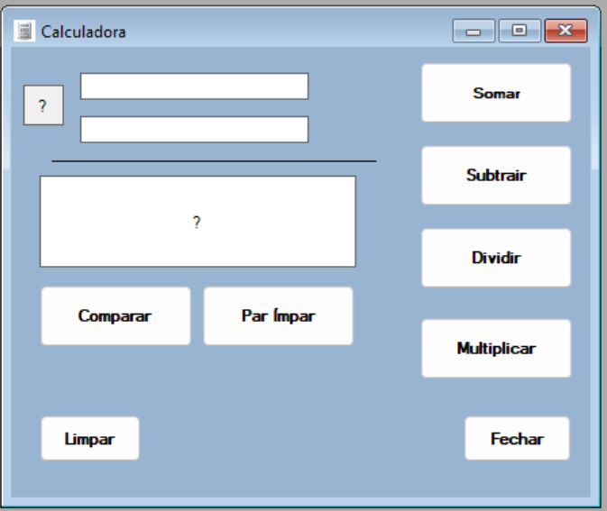
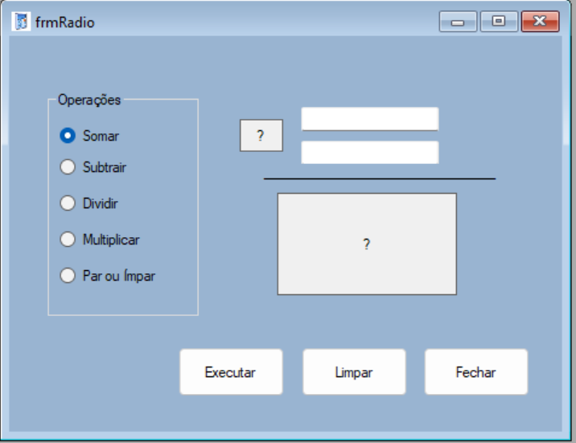
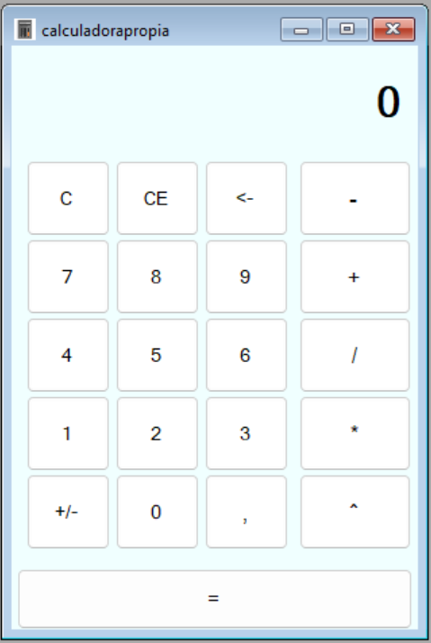

### Projeto de aula Menu Calculadora

Este projeto foi feito em sala de aula, escrito em C# .NET Framework, Windows Forms.

O projeto consiste em ser um software com várias ferramentas, como calculadoras, bloco de notas e um navegador.

### Calculadora básica

O software contém uma calculadora básica, de layout simples e que permite realizar as principais operações, comparar se dois números são ímpar ou par e qual é o maior. Essa calculadora também foi programada de forma com que impeça o usuário de dividir qualquer número por zero, e também de abrir mais uma da mesma instancia,

### Calculadora com radiobuttons

Essa calculadora tem o mesmo funcionamento da anterior, porém você marca qual operação realizar com radiobuttons, e depois clica em um button para realizar a operação com os números digitados nas duas textbox

### Calculadora comum

Essa calculadora funciona como uma padrão do Windows, ela faz as 4 operações junto com exponênciação, transforma o número digitado em negativo ou positivo, tem os botões Clear e Clear Entry e vem com um label mostrando o histórico das contas.

