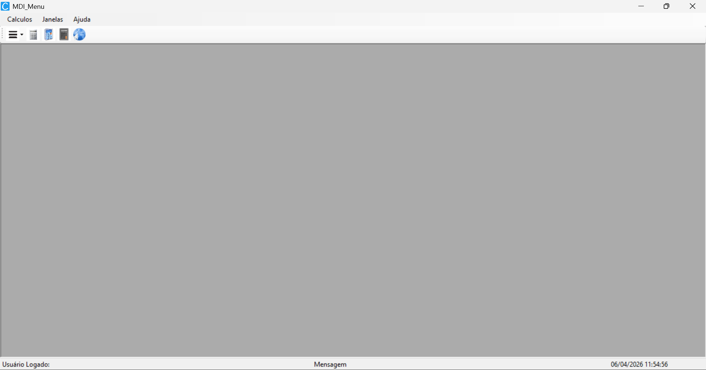

### Projeto de aula Menu Calculadora

Este projeto foi feito em sala de aula, escrito em C# .NET Framework, Windows Forms.

O projeto consiste em ser um software com várias ferramentas, como calculadoras, bloco de notas e navegador.

